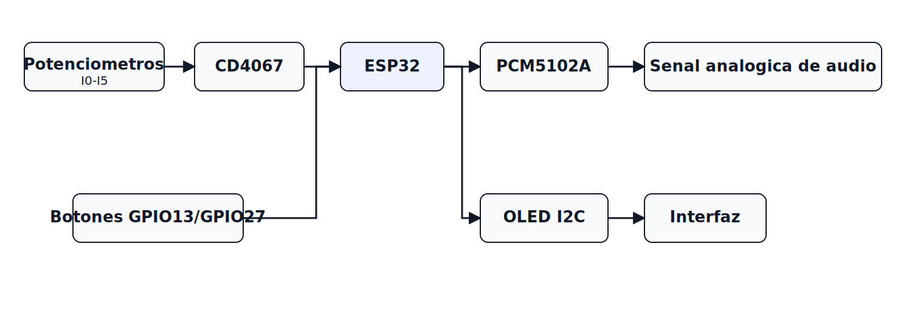
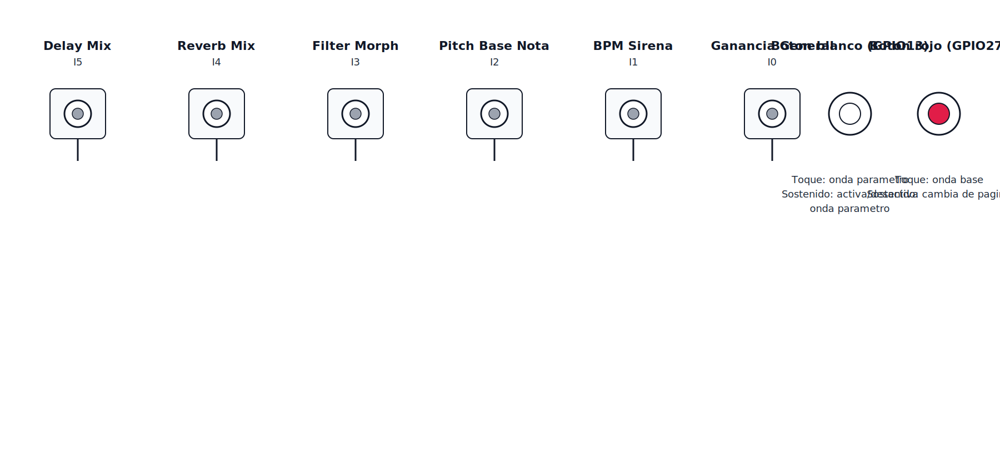

# Synth (ESP32 + PCM5102A)

Firmware simplificado de sirena con un solo LFO de pitch y control por MUX, botones con acciones por toque/pulsacion larga y OLED paginada.

## 0. Resumen Actual

| Estado | Resultado |
|---|---|
| Audio base I2S + PCM5102A | Estable |
| Ruido principal por controles | Corregido al retirar capacitores en wipers |
| Acople entre parametros | Mitigado con escaneo MUX por canal + tiempos de asentamiento |
| Ruido por OLED/I2C | Mitigado con refresco desacoplado y menos frecuente |
| Modo de funcionamiento | Unico modo sirena |
| Interaccion de botones | Toque corto y pulsacion larga activos en GPIO27 y GPIO13 |
| Navegacion OLED | 6 paginas ciclicas (I0 a I5) |
| Puerto de carga validado | COM3/COM4 (segun enumeracion del sistema) |

Arquitectura de senal actual:



Diagrama de panel de control (vista frontal):



## 1. Estado Del Firmware

- Salida de audio por I2S en estereo hacia PCM5102A.
- Un solo LFO activo: Pitch.
- Formas de onda de sirena: Original (O), Seno, Cuadrada, Triangular y Sierra.
- Onda de variacion independiente (preview) con los mismos simbolos graficos de la onda base.
- Nuevo orden de controles:
	- I0: Gain general.
	- I1: Velocidad de sirena (BPM y Hz).
	- I2: Pitch base/nota central de la sirena (se muestra nota y frecuencia).
	- I3: Filter Morph.
	- I4: Reverb Mix.
	- I5: Delay Mix.
- OLED con paginas ciclicas (I0..I5), centradas para lectura rapida.
- En cada pagina se muestra estado de variacion del parametro mostrado: W* activa, W- inactiva.
- Escaneo de MUX por canal (no barrido completo por ciclo) para reducir acople entre controles.
- Lectura ADC con mayor tiempo de asentamiento para reducir arrastre entre canales del CD4067.
- Refresco OLED desacoplado y menos frecuente para bajar ruido inducido por trafico I2C.

## 2. Mapa Funcional De Controles

| Canal MUX | Funcion | Rango |
|---|---|---|
| I0 | Master Gain | 0 .. 100% |
| I1 | Velocidad de sirena | 12 .. 300 BPM |
| I2 | Pitch base (nota central) | 110 .. 880 Hz |
| I3 | Filter Morph | -1 (LP) .. 0 .. +1 (HP) |
| I4 | Reverb Mix | 0 .. 100% |
| I5 | Delay Mix | 0 .. 100% |

## 3. Conexionado Punto A Punto

### 3.1 Alimentacion General Y Masa Comun

- Hay un capacitor ceramico de 100 nF entre 3.3V y GND, colocado cerca de la entrada de alimentacion general.
- ESP32, CD4067, OLED y PCM5102A comparten la misma referencia de GND.
- Existe un capacitor electrolitico de 100 uF entre la alimentacion general y la rama comun que alimenta CD4067, OLED, potenciometros y ESP32.

### 3.2 ESP32 A PCM5102A (I2S)

- GPIO26 -> BCK (con resistencia serie de 47 Ohm).
- GPIO25 -> WS/LRCK/LCK (con resistencia serie de 47 Ohm).
- GPIO22 -> DIN (con resistencia serie de 47 Ohm).
- GND comun -> GND del PCM5102A.

### 3.3 Alimentacion Y Pines De Control Del PCM5102A

Alimentacion digital del modulo:

- 3.3V general -> VIN/VCC del PCM5102A.
- GND general -> GND del PCM5102A.
- Entre VIN y GND hay un ceramico de 100 nF y un electrolitico de 100 uF.

Alimentacion analogica del modulo:

- Filtro RC desde la alimentacion general hacia A3V3.
- R serie: 10 Ohm hacia A3V3.
- Entre A3V3 y AGND hay un electrolitico de 100 uF.
- En paralelo al de 100 uF hay un ceramico de 100 nF, tambien entre A3V3 y AGND.

Pines de control del PCM5102A:

- FMT -> GND (modo I2S estandar).
- XSMT -> 3V3 (salida de audio habilitada).
- SCK/MCLK -> NC (desconectado).
- FLT -> GND.
- DMP/DEMP -> GND.

Salida de audio:

- Se usa el conector jack del modulo PCM5102A.
- No se usan L y R directos por pin en este montaje.

### 3.4 ESP32 A CD4067 (MUX)

- GPIO16 -> S0.
- GPIO17 -> S1.
- GPIO19 -> S2.
- GPIO18 -> S3.
- EN -> GND (habilitado permanente).
- VCC -> 3V3.
- GND -> GND comun.
- Entre VCC y GND del CD4067 hay un ceramico de 100 nF.

Filtro RC entre salida del MUX y ADC:

- SIG/OUT del CD4067 -> R serie de 1 kOhm -> GPIO35 del ESP32.
- Desde el nodo de GPIO35 a GND hay un capacitor ceramico de 100 nF.

### 3.5 Potenciometros Hacia El CD4067

Conexion de cada potenciometro:

- Terminal 1 -> 3V3.
- Terminal central (wiper) -> Ix/Cx del CD4067.
- Terminal 3 -> GND.
- Actualmente no se usa capacitor entre wiper y GND (se retiro para eliminar ruido y acople entre canales).

Canales usados:

- I0/C0 -> Master Gain.
- I1/C1 -> Velocidad de sirena (BPM).
- I2/C2 -> Pitch base (nota central).
- I3/C3 -> Filter Morph.
- I4/C4 -> Reverb Mix.
- I5/C5 -> Delay Mix.

### 3.6 ESP32 A OLED SSD1306 (I2C)

- GPIO21 <-> SDA.
- GPIO23 <-> SCL.
- 3V3 -> VCC.
- GND -> GND.
- Direccion I2C en firmware: 0x3C.

### 3.7 ESP32 A Botones

Conexion electrica (INPUT_PULLUP en firmware):

- Boton rojo: GPIO27 a GND al pulsar.
- Boton blanco: GPIO13 a GND al pulsar.
- Cada boton tiene un ceramico de 100 nF entre su GPIO y GND.

Funcion en firmware:

- Boton rojo (GPIO27), toque corto: cambia la forma de onda base de la sirena en este orden: ORIG -> SIN -> SQR -> TRI -> SAW.
- Boton rojo (GPIO27), pulsacion larga: cambia de pagina/parametro (I0 -> I1 -> I2 -> I3 -> I4 -> I5 -> I0).
- Boton blanco (GPIO13), toque corto: recorre la forma de onda de variacion del parametro de la pagina actual.
- Boton blanco (GPIO13), pulsacion larga: selecciona o deselecciona esa variacion para el parametro de la pagina actual.
- La variacion es independiente por parametro: cada pagina conserva su propia forma de variacion y estado W*/W-.

## 4. Resumen Rapido De Pines ESP32

| Bloque | Pines ESP32 |
|---|---|
| I2S audio | GPIO26 (BCK), GPIO25 (WS/LRCK), GPIO22 (DIN) |
| MUX control | GPIO16 (S0), GPIO17 (S1), GPIO19 (S2), GPIO18 (S3) |
| MUX lectura ADC | GPIO35 (SIG/OUT) |
| OLED I2C | GPIO21 (SDA), GPIO23 (SCL) |
| Botones | GPIO27 (Wave base + cambio de pagina), GPIO13 (Wave variacion + seleccion por pagina) |

## 5. Build Y Carga

Compilar:

```powershell
pio run
```

Subir firmware:

```powershell
pio run -t upload --upload-port COM3
```

Tambien puede ser necesario usar COM4 segun la enumeracion actual.

Monitor serie:

```powershell
pio device monitor -b 921600
```

## 6. Notas De Montaje Confirmadas

- Pin FLT del PCM5102A: a GND.
- Pin DMP/DEMP del PCM5102A: a GND.
- No se agregaron resistencias pull-up I2C externas para el OLED en el hardware.
- El bus I2C funciona en este estado, por lo que el modulo OLED probablemente ya incluye pull-ups internos.
- Se retiraron los capacitores entre wiper y GND de los potenciometros; con este cambio desaparecio el ruido principal.
- El filtro de SIG hacia GPIO35 se usa con R=1k y C=100 nF ceramico.
